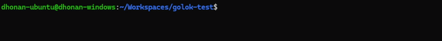

# ⚔️ **golok**

Ever wanted your logs to _look cool_ and _feel alive_ like this?



Say no more—**golok** slices through boring logs like a blade through butter.

---

## 🧩 **A. Installation**

```bash
go get github.com/dhonanhibatullah/golok
```

---

## 🚀 **B. What is golok?**

**golok** is a lightweight, customizable logging library for Go that lets you build _dynamic_, _styled_, and _interactive_ terminal logs.

It’s made of 4 essential parts:

---

### **1. Golok Instance**

The core engine to drive your logging. It manages multiple profiles:

```go
glk := golok.NewGolok()
defer glk.Close()
```

---

### **2. Profile**

Think of a **profile** as a single log line—composed of multiple styled components.

Create a profile with a specified line index like so:

```go
glkProfile := glk.NewProfile(index)
```

---

### **3. Component**

A profile is made up of components. Golok supports:

- `Text`
- `ProgressBar`
- `Timestamp`
- `Datetime`

Each component (except `Timestamp` and `Datetime`) needs a **bind** (pointer to a value).

```go
textVal := "Hello Dhonan!"
progressVal := uint8(34)

myText := golok.NewText(&textVal, style1)
myProgressBar := golok.NewProgressBar(&progressVal, 40, style2)
myTimestamp := golok.NewTimestamp(golok.Second, 0, style3)
myDatetime := golok.NewDatetime(golok.YYYYnMMnDD_TimeMilli, style4)

glkProfile.AddComponent(0, myText)
glkProfile.AddComponent(1, myProgressBar)
glkProfile.AddComponent(2, myTimestamp)
glkProfile.AddComponent(3, myDatetime)
```

---

### **4. Styling**

Each component can be styled! Here’s the available styling options:

```go
type Styling struct {
	Bold          bool
	Italic        bool
	Underline     bool
	Strikethrough bool
	EnableFg      bool
	EnableBg      bool
	Fg            uint32
	Bg            uint32
	Format        string
}
```

A style example:

```go
style1 := &Styling{
    Bold:     true,
    EnableFg: true,
    EnableBg: true,
    Fg:       0xFFFFFF,
    Bg:       0x009E91,
    Format:   "%s",
}
```

> 💡 `Format` controls how the value is printed (must include exactly one `%s`). Leave it empty for raw output.

---

### **5. Complete Example**

Here’s a quick full example you can try right now:

```go
package main

import (
	"context"
	"time"

	"github.com/dhonanhibatullah/golok"
)

func createStyle(fg uint32, bg uint32, format string) *golok.Styling {
	return &golok.Styling{
		Bold:     true,
		EnableFg: true,
		EnableBg: true,
		Fg:       fg,
		Bg:       bg,
		Format:   format,
	}
}

func myRoutine(cancel context.CancelFunc, p *golok.Profile) {
	defer p.Close()
	defer cancel()

	textVal := ""
	progressVal := uint8(34)

	myText := golok.NewText(&textVal, createStyle(0xA15E00, 0xFFFFFF, " >> %s "))
	myProgressBar := golok.NewProgressBar(&progressVal, 40, createStyle(0xBDE300, 0x000000, " %s "))
	myTimestamp := golok.NewTimestamp(golok.Second, 0, createStyle(0x0AFF3B, 0x000000, " [ %s ] "))
	myDatetime := golok.NewDatetime(golok.YYYYnMMnDD_TimeMilli, createStyle(0x00CFCF, 0x000000, " < %s > "))

	p.AddComponent(3, myText)
	p.AddComponent(2, myProgressBar)
	p.AddComponent(0, myTimestamp)
	p.AddComponent(1, myDatetime)

	textVal = "Downloading..."
	progressVal = 25
	p.Render()
	time.Sleep(time.Second)

	textVal = "Installing..."
	progressVal = 50
	p.Render()
	time.Sleep(time.Second)

	textVal = "Starting..."
	progressVal = 75
	p.Render()
	time.Sleep(time.Second)

	textVal = "Finishing..."
	progressVal = 100
	p.Render()
	time.Sleep(time.Second)
}

func main() {
	ctx, cancel := context.WithCancel(context.Background())
	glk := golok.NewGolok()
	defer glk.Close()

	go myRoutine(cancel, glk.NewProfile(0))
	<-ctx.Done()
}
```

The result?


---
